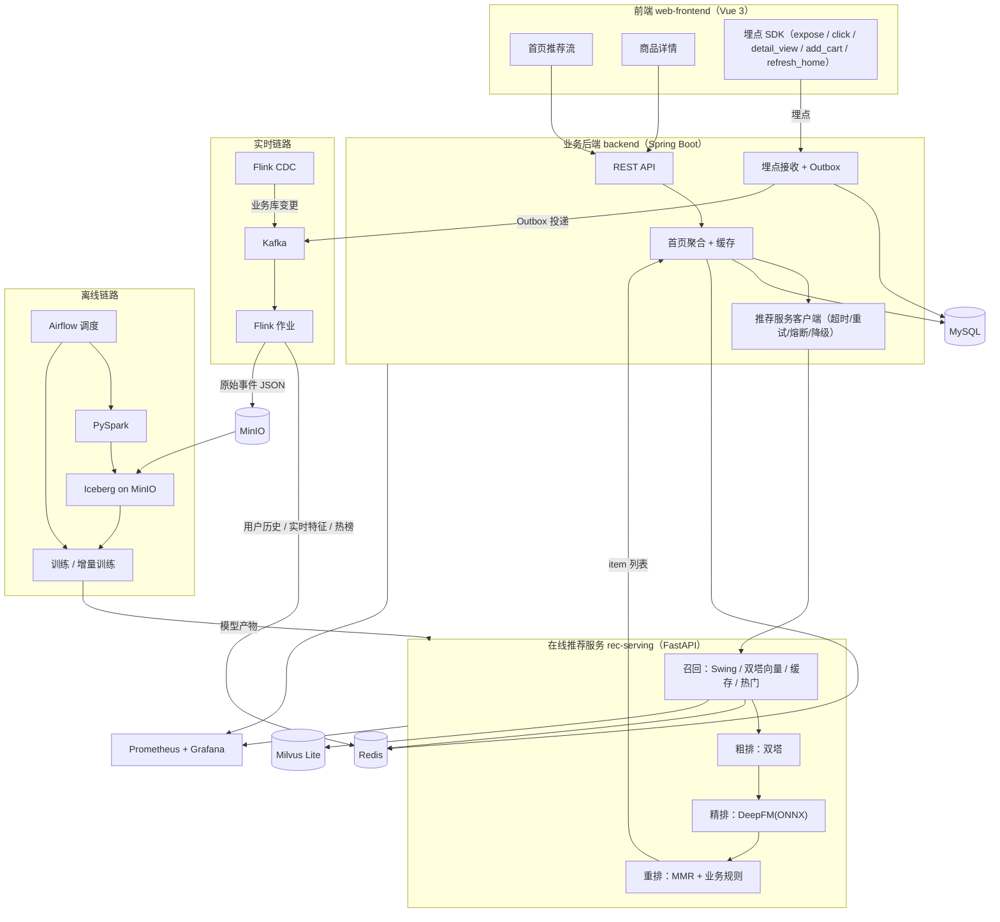

# End-To-End Recommendation System X

一个单机可运行的**推荐系统全链路**学习项目：从数据采集、数仓分层、模型训练，到在线四阶段推荐（召回 → 粗排 → 精排 → 重排），再到用户行为埋点回流形成的闭环。

## 为什么做这个项目

推荐系统是一个综合性的工程，涉及前端、后端、数据开发、算法等多个方向。这个项目的目标是把这些技术栈真正串起来：

- 让初学者感受推荐系统**全链路**是怎么跑起来的，而不是只跑一个模型
- 让初学者感受数据从**产生 → 清洗 → 消费**的完整闭环
- 提供一个可扩展的骨架，后续可以在它之上继续实现特征管理、LLM 打标、算法平台搭建、AB 实验平台、实时推荐链路优化等能力

项目重心是**工程链路完整**和**模块可替换**，不追求推荐效果准确率——召回模型能召回、粗排精排能排、最终能返回一份功能正确的推荐列表即可。

## 项目能做什么

### 在线推荐（四阶段）

- 多路召回：Swing 协同过滤、双塔向量召回（Milvus Lite）、缓存召回、热门召回
- 粗排：双塔 item 向量与用户向量点积
- 精排：DeepFM（导出为 ONNX，在线推理）
- 重排：MMR 多样性 + 类目 / 品牌 / 价格业务规则
- 冷启动：新用户无历史时走热门召回与兜底列表
- 降级：Redis 不可用、推荐服务不可用时自动回退

### 在线行为闭环

- 前端埋点：曝光（`expose`）、点击（`click`）、详情浏览（`detail_view`）、加购（`add_cart`）、刷新首页（`refresh_home`）
- 埋点先落库再进 Kafka（事务性 Outbox，失败自动退避重试）
- Flink 实时消费行为事件：写入用户点击历史、点击计数、实时热门榜、窗口特征，并把原始事件落到 MinIO
- 点击类行为会失效首页缓存，刷新首页即可看到新的推荐列表

### 离线数仓与训练

- Iceberg 分层数仓：ODS → DWD → DWS → ADS（Spark 计算，MinIO 存储）
- 全量训练：Swing 相似度、双塔、DeepFM，产出模型、向量索引、热门列表
- 增量训练：复用上一版 checkpoint，用最近行为继续训练，产出新版本
- 增量数仓：基于水位线只处理新增数据，DWS 用 MERGE 累加、ADS 追加样本
- 模型注册与版本管理：MySQL 记录版本、产物路径、指标、状态，支持在线热加载

### 实时与调度

- Flink CDC 采集业务库变更到 Kafka
- Airflow 编排首次全量导入、每日增量数仓 + 增量训练、每周全量训练
- Prometheus + Grafana 采集与展示推荐服务和后端指标

### 可选数据链路

- DataX：MySQL 表级批量同步
- Flume：日志采集到 Kafka

## 技术栈

| 层次 | 技术 |
|---|---|
| 前端 | Vue 3、Vite、Pinia、Element Plus |
| 业务后端 | Java 17、Spring Boot 3、MyBatis-Plus、Flyway、Spring Security (JWT)、Spring Kafka |
| 在线推荐服务 | Python 3.12、FastAPI、PyTorch、ONNX Runtime、pymilvus |
| 向量检索 | Milvus Lite（嵌入式本地文件） |
| 离线计算 | PySpark、Apache Iceberg、Hadoop S3A |
| 实时计算 | Java + Flink、Flink CDC |
| 消息队列 | Kafka（KRaft 单机） |
| 对象存储 | MinIO（S3 兼容） |
| 业务库 / 元数据 | MySQL 8.4 |
| 缓存与在线特征 | Redis |
| 调度 | Apache Airflow |
| 数据同步（可选） | DataX、Flume |
| 监控 | Prometheus、Grafana、Micrometer |

## 系统架构



架构上的三个原则：

1. **三个应用服务相互独立**：前端、业务后端、推荐服务各自独立构建与运行，通过 HTTP 交互。
2. **算法模块可替换**：召回的每一路、粗排、精排、重排都通过统一接口接入，替换算法不影响链路其它部分。
3. **在线只读缓存与内存**：在线推理只读 Redis 与本地模型产物，不触发 Spark 等重计算。

## 使用的数据集

**Taobao Display Ad Click**（阿里展示广告点击数据集，别名 `Ali_Display_Ad_Click`）

- 官方地址：<https://tianchi.aliyun.com/dataset/56>
- 主题：电商广告点击，因此本项目的推荐对象是"广告商品"

| 文件 | 内容 |
|---|---|
| `raw_sample.csv` | 曝光与点击行为：用户、广告、时间戳、资源位、是否点击（`clk`） |
| `ad_feature.csv` | 广告（商品）特征：类目、品牌、价格、营销活动、商家 |
| `user_profile.csv` | 用户画像：性别、年龄层级、消费层级、购物深度、职业等 |

约定：

- 数据集的 `adgroup_id` 统一映射为推荐系统的 `item_id`
- 行为表的 `time_stamp` 为秒级时间戳，作为 DWD 层的 `event_time`
- 曝光事件对应 `label = 0`（负样本），点击事件对应 `label = 1`（正样本）
- 曝光与点击在数仓中统一为 `behavior_event` 表，用 `event_type` 区分

数据集需要自行从官方渠道下载后放入项目根目录的 `Data/` 下（该目录不纳入版本管理）。

## 服务构成

### 三个独立应用服务

| 服务 | 技术 | 默认端口 | 职责 |
|---|---|---|---|
| `web-frontend` | Vue 3 + Vite | 5173 | 登录、首页推荐流、商品详情、行为埋点 |
| `backend` | Spring Boot | 8080 | 用户、商品、首页聚合、埋点接收、推荐服务调用 |
| `rec-serving` | FastAPI | 8000 | 四阶段在线推荐、模型加载与热更新 |

### 基础设施与计算组件

| 组件 | 默认端口 | 作用 |
|---|---|---|
| MySQL | 3306 | 业务库（用户/商品/行为/模型注册/Outbox/水位线） |
| Redis | 6379 | 在线特征与首页缓存 |
| MinIO | 9000（S3 API）/ 9001（控制台） | S3 兼容对象存储，存放 Iceberg 与实时原始事件 |
| Kafka | 9092（broker）/ 9093（controller） | 行为事件与 CDC 消息 |
| Flink 作业 ×2 | 无端口（本地 MiniCluster） | 实时特征计算、业务库 CDC |
| Airflow | 8081 | 离线数仓与训练调度（webserver + scheduler） |
| Prometheus / Grafana | 9090 / 3000 | 指标采集与看板 |
| Flume / DataX | — | 可选：日志采集、批量同步 |

### 不是独立服务的组件

- **Apache Iceberg**：Spark 的 catalog 插件，随 PySpark 进程加载，没有常驻进程
- **Milvus Lite**：嵌入式向量库，由推荐服务直接打开本地文件
- **DataX**：一次性批处理程序，执行完即退出

## 目录结构

```text
End-To-End_Recommendation_System_X/
├── web-frontend/                 # Vue 3 前端（独立服务）
│   ├── src/
│   │   ├── views/                # 登录页、首页、商品详情页
│   │   ├── services/             # 后端 API 封装、埋点 SDK
│   │   └── router/
│   └── tests/                    # 埋点相关单测
│
├── backend/                      # Spring Boot 业务后端（独立服务）
│   ├── src/main/java/com/example/backend/
│   │   ├── controller/           # 用户、首页、商品、埋点接口
│   │   ├── service/              # 业务逻辑、Outbox 投递、推荐服务客户端
│   │   ├── entity/ mapper/ dto/  # MyBatis-Plus 实体与映射
│   │   └── config/               # 安全、健康检查
│   └── src/main/resources/
│       ├── application.yml       # 配置（凭据来自环境变量 / .env.local）
│       └── db/migration/         # Flyway 迁移脚本
│
├── rec-serving/                  # Python 在线推荐服务（独立服务）
│   ├── app/
│   │   ├── pipeline/             # 召回 / 粗排 / 精排 / 重排实现
│   │   ├── features.py           # Redis 特征读取
│   │   ├── artifacts.py          # 模型产物加载与热更新
│   │   └── metrics.py            # Prometheus 指标
│   └── tests/
│
├── offline/                      # 离线链路
│   ├── pyspark/                  # 数仓 ETL、特征导出、增量处理
│   ├── training/                 # 模型训练、增量训练、模型注册
│   └── tests/
│
├── streaming/flink-realtime/     # Java Flink 实时作业
│   └── src/main/java/com/example/flink/
│       ├── BehaviorRealtimeJob   # 实时特征作业
│       ├── MySqlCdcJob           # 业务库 CDC 作业
│       └── RedisFeatureStore     # 在线特征写入
│
├── airflow/                      # Airflow DAG（首次全量 / 每日增量 / 每周全量）
├── data-sync/                    # 可选数据同步（DataX 作业、Flume 配置）
├── monitoring/                   # Prometheus 采集配置、Grafana 数据源与看板
├── scripts/                      # 启动、验证、同步等运维脚本
├── Data/                         # 原始数据集（不纳入版本管理）
└── .env.local.example            # 本地凭据模板（真实值放在 .env.local）
```

## 配置约定

仓库里**不包含任何真实凭据**（数据库密码、对象存储密钥、JWT 密钥等）。所有凭据通过环境变量注入，本地开发时集中放在项目根目录的 `.env.local`（已被 `.gitignore` 忽略），模板见 `.env.local.example`：

```text
MYSQL_*                 业务库连接信息
MINIO_*                 对象存储地址与密钥
JWT_SECRET              后端 JWT 签名密钥
GRAFANA_ADMIN_PASSWORD  Grafana 管理员密码
```

Bash 脚本、PySpark 脚本、Spring Boot 都会优先读取这些环境变量；
Airflow 元数据库、Grafana 运行数据、模型产物、原始数据集等均不纳入版本管理。

## 说明

- 项目为单机学习用途，所有组件都运行在本机，未做分布式部署与高可用。
- 设计文档、图表与开发计划保存在本地 `docs/` 目录，未包含在本仓库中。
