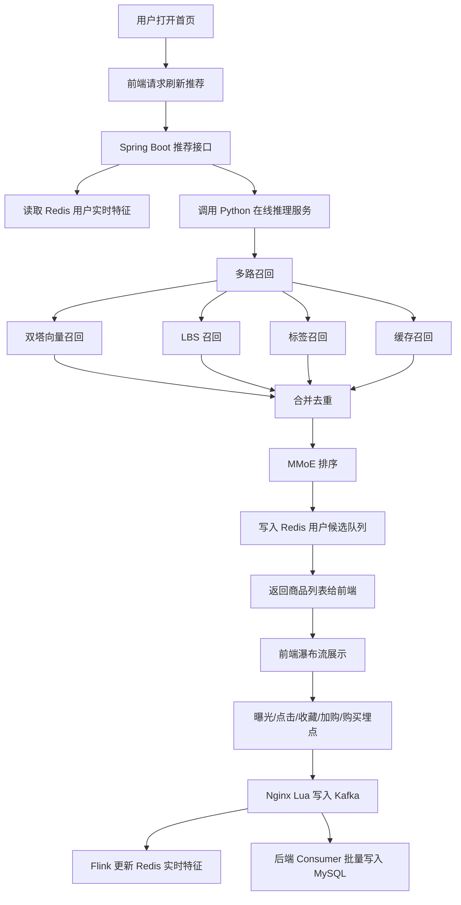

# 电商网站与推荐系统 PRD

## 1. 文档信息

| 项目 | 内容 |
| --- | --- |
| 产品名称 | 单机版电商推荐系统 |
| 部署形态 | Windows 单机部署 |
| 当前阶段 | MVP 设计阶段 |
| 核心目标 | 搭建可演示、可联调、可扩展的电商首页与推荐推理链路 |
| 优先级 | 在线模型推理 > 推荐链路闭环 > 前端个性化展示 > 离线训练效果 |

## 2. 背景与目标

本项目用于构建一个面向学习、实验和演示的电商网站及推荐系统。系统需要具备完整的用户行为采集、推荐请求、召回、排序、候选缓存、行为落库、离线训练和在线推理流程。

当前阶段不追求推荐效果最优，优先保证：

1. 用户能打开首页并看到商品瀑布流。
2. 首页自动触发一次推荐刷新。
3. 用户点击、曝光、收藏、加购、购买行为可以被采集。
4. 推荐服务可以调用在线推理服务完成召回和排序。
5. 训练和推理共用同一套特征预处理逻辑。
6. 所有连接配置集中放在主目录 `conf` 文件中。

## 3. 用户角色

| 角色 | 说明 | 核心诉求 |
| --- | --- | --- |
| 普通用户 | 浏览首页商品并产生交互 | 商品展示流畅、推荐列表持续刷新 |
| 系统管理员 | 启动、配置、观察系统 | 单机部署简单、配置集中、日志清晰 |
| 算法开发者 | 训练和发布模型 | 数据链路清楚、特征不泄露、模型可替换 |
| 后端开发者 | 提供 REST API 和推荐服务编排 | 接口清晰、缓存和数据库边界清楚 |

## 4. 产品范围

### 4.1 本期包含

- Vue 3 + Element Plus 首页。
- 商品瀑布流展示。
- 商品点击、曝光、收藏、加购、购买五类埋点。
- 下拉预取，距离底部 200px 时请求下一页。
- 前端 ItemID 去重。
- 手动刷新推荐。
- 首页首次进入自动刷新推荐。
- 商品候选全部曝光后自动刷新推荐。
- Spring Boot REST API。
- MySQL 存储用户、商品、行为、推荐结果快照等数据。
- Redis 存储用户实时特征、候选商品、曝光集合和缓存召回。
- Kafka 作为行为日志入口。
- Flink 消费 Kafka 更新 Redis 实时特征。
- Python 推理服务实现召回和排序。
- PyTorch 模型文件加载到内存后提供推理。
- Milvus 存储物品向量并提供 ANN 检索。
- LBS 召回：基于用户位置和商品位置召回附近商品。
- 标签召回：基于商品标签、类目、品牌、价格段等维度召回候选。
- 离线训练脚本按前 7 天数据训练。

### 4.2 本期不包含

- 不做商品详情页。
- 不做复杂订单、支付、库存系统。
- 不做数仓。
- 不做粗排。
- 不做重排。
- 不做冷启动专项优化。
- 不追求线上级高可用和分布式扩容。
- 不以推荐指标最优为本期验收标准。

## 5. 核心业务流程

## 6. 功能需求

### 6.1 首页商品流

| 编号 | 功能 | 描述 | 优先级 |
| --- | --- | --- | --- |
| FE-001 | 首页自动刷新 | 用户首次进入首页后自动请求推荐刷新接口 | P0 |
| FE-002 | 瀑布流展示 | 商品以两列或多列瀑布流展示，适配不同屏幕 | P0 |
| FE-003 | 预取下一页 | 滚动到页面底部前 200px 触发下一页请求 | P0 |
| FE-004 | 商品去重 | 前端维护已展示 ItemID 集合，过滤重复商品 | P0 |
| FE-005 | 手动刷新 | 点击刷新按钮触发在线推理并替换推荐候选 | P0 |
| FE-006 | 自动刷新 | 当前候选商品全部曝光后触发刷新 | P1 |
| FE-007 | 操作按钮 | 每个商品提供点击、收藏、加购物车、购买四个按钮 | P0 |

### 6.2 埋点采集

| 编号 | 功能 | 描述 | 优先级 |
| --- | --- | --- | --- |
| LOG-001 | 曝光埋点 | 商品进入视口时发送 BehaviorType=0 | P0 |
| LOG-002 | 点击埋点 | 用户点击商品卡片或点击按钮时发送 BehaviorType=1 | P0 |
| LOG-003 | 收藏埋点 | 用户点击收藏时发送 BehaviorType=2 | P0 |
| LOG-004 | 加购埋点 | 用户点击加购物车时发送 BehaviorType=3 | P0 |
| LOG-005 | 购买埋点 | 用户点击购买时发送 BehaviorType=4 | P0 |
| LOG-006 | 幂等控制 | 同一商品在同一推荐批次内只发送一次曝光 | P1 |

行为数据字段：

| 字段 | 类型 | 说明 |
| --- | --- | --- |
| userId | long/string | 用户 ID，游客可使用临时 ID |
| itemId | long/string | 商品 ID |
| behaviorType | int | 0 曝光，1 点击，2 收藏，3 加购，4 购买 |
| timestamp | long | 毫秒时间戳 |
| requestId | string | 推荐请求 ID，用于串联曝光和推荐结果 |
| scene | string | 推荐场景，首页为 `home` |

### 6.3 推荐刷新

刷新触发来源：

1. 用户打开首页。
2. 用户点击刷新按钮。
3. 当前候选商品全部曝光。
4. Redis 中用户候选队列不存在或过期。

刷新结果：

- 后端调用在线推理服务。
- 推理服务返回排序后的候选商品。
- 后端写入 Redis 候选队列，TTL 为 24 小时。
- 前端清空已展示集合并展示新推荐批次。

### 6.4 多路召回

| 召回通道 | 输入 | 输出 | 优先级 |
| --- | --- | --- | --- |
| 双塔向量召回 | 用户实时特征、用户 ID、Milvus 物品向量 | 语义相似商品候选 | P0 |
| 缓存召回 | 精排 Top 50 未曝光商品 | 用户未看过的高分商品 | P0 |
| LBS 召回 | 用户 geohash、商品 geohash、距离阈值 | 附近或同城商品候选 | P1 |
| 标签召回 | 用户标签偏好、商品标签、类目、品牌、价格段 | 与用户兴趣标签匹配的商品候选 | P1 |
| 热门召回 | 全局热门商品 | 推理异常或冷数据降级候选 | P1 |

LBS 召回要求：

- 优先使用用户最近行为中的 `user_geohash`。
- 用户位置缺失时不强行召回，直接跳过该通道。
- 商品位置缺失时不进入 LBS 候选池。
- MVP 阶段可以先用 geohash 前缀匹配，后续再计算精确距离。

标签召回要求：

- 商品可拥有多个标签，例如类目、品牌、风格、价格段、热度段。
- 用户标签偏好由 Flink 根据实时行为聚合，也可由离线任务每日更新。
- 支持按不同维度筛选，例如只按类目、只按品牌、类目加价格段组合。
- 标签召回结果需要和其他召回通道合并去重。

## 7. 非功能需求

| 类型 | 要求 |
| --- | --- |
| 性能 | 单次推荐刷新在本机开发环境目标 1-3 秒内返回 |
| 推理 | 模型服务启动时一次性加载权重到内存 |
| 可靠性 | 推理失败时后端降级返回热门商品或 Redis 旧候选 |
| 可观测性 | 每个推荐请求生成 requestId 并写日志 |
| 配置 | MySQL、Redis、Kafka、Milvus、TorchServe 等配置统一放在主目录 `conf/application-local.yml` |
| 数据安全 | 训练特征必须满足 `Feature_Time < Label_Time` |
| 可维护性 | 前端、后端、数据链路、离线训练、在线推理分别独立目录 |

## 8. 验收标准

| 场景 | 验收方式 |
| --- | --- |
| 首页展示 | 启动系统后访问前端首页，可以看到商品瀑布流 |
| 自动刷新 | 首次进入首页后，后端日志出现推荐刷新请求 |
| 手动刷新 | 点击刷新按钮后，商品列表被替换或追加新批次 |
| 曝光埋点 | 商品进入视口后 Kafka 收到 BehaviorType=0 |
| 行为埋点 | 点击四类按钮后 Kafka 收到对应行为类型 |
| 在线推理 | 后端推荐刷新接口成功调用 Python 推理服务 |
| 缓存候选 | Redis 中存在用户推荐候选 key，且 TTL 为 24 小时 |
| 数据落库 | 批处理后 MySQL 行为表新增行为数据 |

## 9. 补充需求：基础用户体系

### 9.1 目标

后端需要提供基本用户管理能力，使推荐系统不只依赖临时游客 ID，而是能把用户行为长期沉淀到稳定的 `userId` 上。

### 9.2 功能范围

| 编号 | 功能 | 描述 | 优先级 |
| --- | --- | --- | --- |
| USER-001 | 用户注册 | 用户使用用户名和密码注册，系统生成稳定 `userId` | P0 |
| USER-002 | 用户登录 | 用户登录成功后返回 JWT token 和用户信息 | P0 |
| USER-003 | 当前用户信息 | 根据 token 查询当前用户资料 | P0 |
| USER-004 | 用户资料修改 | 修改昵称、头像、手机号、邮箱、性别、年龄段、默认 geohash | P1 |
| USER-005 | 修改密码 | 登录用户可修改自己的密码 | P1 |
| USER-006 | 用户退出 | 前端清除 token，后端可选加入 token 黑名单 | P1 |
| USER-007 | 管理员分页查询用户 | 按用户名、手机号、状态、角色查询用户 | P1 |
| USER-008 | 管理员禁用/启用用户 | 禁用后用户不能登录，已登录 token 可加入黑名单 | P1 |
| USER-009 | 管理员重置密码 | 管理员为指定用户重置密码 | P2 |
| USER-010 | 管理员调整角色 | 支持 `USER` 和 `ADMIN` 两类基础角色 | P2 |

### 9.3 认证与安全要求

- 登录态采用 JWT。
- 密码只保存 BCrypt 哈希，不保存明文密码。
- 管理接口必须校验 `ADMIN` 角色。
- 推荐、收藏、加购、购买等接口优先从 token 中解析 `userId`。
- 游客仍可浏览首页；注册或登录后，前端应切换为后端返回的稳定 `userId`。
- 用户被禁用后不能再次登录；必要时将已有 token 加入 Redis 黑名单。

### 9.4 验收标准

| 场景 | 验收方式 |
| --- | --- |
| 注册 | 调用注册接口后 `biz_user` 新增用户，密码字段不是明文 |
| 登录 | 正确密码返回 token，错误密码返回认证失败 |
| 当前用户 | 携带 token 可查询当前用户资料 |
| 推荐串联 | 登录后推荐请求使用登录用户的 `userId` |
| 管理员管理 | 管理员可查询、禁用、启用用户 |
