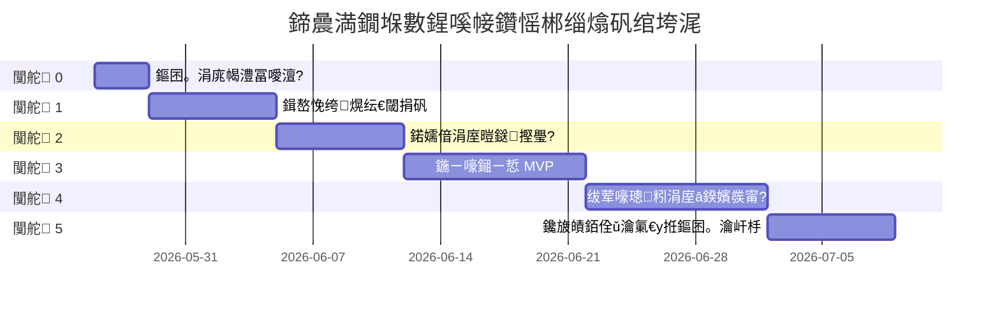

# 浜у搧璺嚎鍥?
## 1. 鎬讳綋闃舵

## 2. 闃舵 0锛氭枃妗ｄ笌鐜鍑嗗

鐩爣锛氬畬鎴愰」鐩璁″拰鍗曟満杩愯渚濊禆瑙勫垝銆?
浜や粯鐗╋細

- PRD銆?- 鎶€鏈柟妗堣璁℃枃妗ｃ€?- 鏁版嵁搴撹璁℃枃妗ｃ€?- API 鏂囨。銆?- 璇︾粏璁捐鏂囨。銆?- 寮€鍙戣鑼冦€?- README銆?- 涓荤洰褰曢厤缃枃浠惰璁°€?
楠屾敹锛?
- 鎵€鏈夋枃妗ｄ綅浜?`E:\End-To-End_Recommendation_System_X\docs`銆?- 閰嶇疆闆嗕腑鍦?`E:\End-To-End_Recommendation_System_X\conf\application-local.yml` 鐨勮璁′腑銆?- 鏄庣‘涓嶇敓鎴愪笟鍔′唬鐮併€?
## 3. 闃舵 1锛氬墠鍚庣鍩虹閾捐矾

鐩爣锛氬厛璁╃敤鎴疯兘鐪嬪埌棣栭〉鍟嗗搧娴侊紝骞惰兘瑙﹀彂鎺ㄨ崘鍒锋柊銆?
鑼冨洿锛?
- Vue 3 椤圭洰鍒濆鍖栥€?- Element Plus銆丳inia銆丄xios 闆嗘垚銆?- 棣栭〉鐎戝竷娴?UI銆?- Spring Boot 3 Maven 椤圭洰鍒濆鍖栥€?- 鍟嗗搧鏌ヨ鎺ュ彛銆?- 鎺ㄨ崘鍒锋柊鎺ュ彛銆?- MySQL 鍟嗗搧琛ㄥ拰鐢ㄦ埛琛ㄥ熀纭€鏁版嵁銆?
鍏抽敭缁撴灉锛?
- `GET /api/v1/recommendations/home` 鍙繑鍥炲晢鍝佸垪琛ㄣ€?- `POST /api/v1/recommendations/refresh` 鍙埛鏂版帹鑽愭壒娆°€?- 鍓嶇棣栭〉棣栨鎵撳紑鑷姩璇锋眰鎺ㄨ崘鎺ュ彛銆?
## 4. 闃舵 2锛氬煁鐐逛笌鏁版嵁閾捐矾

鐩爣锛氭妸鐢ㄦ埛琛屼负浠庡墠绔噰闆嗗埌 Kafka锛屽苟鑳芥壒閲忚惤 MySQL銆?
鑼冨洿锛?
- 鍓嶇 IntersectionObserver 鏇濆厜鍩嬬偣銆?- 鐐瑰嚮銆佹敹钘忋€佸姞璐€佽喘涔拌涓哄煁鐐广€?- Nginx Lua 鏀堕泦 HTTP 琛屼负鏃ュ織骞跺啓鍏?Kafka銆?- Spring Kafka Consumer 娑堣垂琛屼负鏃ュ織銆?- 姣忓ぉ鍑屾櫒鎵归噺鍐欏叆 MySQL銆?- Flink 娑堣垂 Kafka 骞舵洿鏂?Redis 鐢ㄦ埛瀹炴椂鐗瑰緛銆?
鍏抽敭缁撴灉锛?
- Kafka topic `user_behavior_log` 鏈夊疄鏃舵秷鎭€?- Redis 涓敤鎴风偣鍑诲簭鍒椼€佽喘涔板簭鍒楀彲琚洿鏂般€?- MySQL 琛屼负鏄庣粏琛ㄥ彲淇濆瓨绂荤嚎璁粌鏁版嵁銆?
## 5. 闃舵 3锛氬湪绾挎帹鐞?MVP

鐩爣锛氬疄鐜板彲鐢ㄧ殑鍦ㄧ嚎鍙洖鍜屾帓搴忚繃绋嬶紝鎺ㄨ崘鏁堟灉鏆備笉鍋氬己瑕佹眰銆?
鑼冨洿锛?
- Python 鎺ㄧ悊鏈嶅姟銆?- 鍔犺浇鍙屽鐢ㄦ埛濉旀ā鍨嬨€?- 鍔犺浇 MMoE 鎺掑簭妯″瀷銆?- 鏌ヨ Milvus 鐗╁搧鍚戦噺銆?- 杩斿洖 Top 500 鍙洖缁撴灉銆?- 瀵瑰彫鍥炵粨鏋滄帓搴忋€?- 鍚庣灏嗘帓搴忕粨鏋滃啓鍏?Redis銆?
鍏抽敭缁撴灉锛?
- 鍚庣鎺ㄨ崘鍒锋柊鎺ュ彛鑳借皟鐢ㄦ帹鐞嗘湇鍔°€?- 鎺ㄧ悊鏈嶅姟鍗充娇浣跨敤鍒濈増妯″瀷锛屼篃鑳界ǔ瀹氳繑鍥炲€欓€夊晢鍝併€?- 鎺ㄧ悊澶辫触鏃跺悗绔彲浠ラ檷绾ц繑鍥炵儹闂ㄥ晢鍝併€?
## 6. 闃舵 4锛氱绾胯缁冧笌妯″瀷鍙戝竷

鐩爣锛氱敤澶╂睜鏍煎紡鏁版嵁璁粌鍙笂绾跨殑鍙洖鍜屾帓搴忔ā鍨嬨€?
鑼冨洿锛?
- 鏁版嵁璇诲彇鍜屾竻娲椼€?- Time Split 鍒囧垎銆?- 缁熶竴鐗瑰緛棰勫鐞嗘ā鍧椼€?- 鍙屽 Pairwise 璁粌銆?- 鐗╁搧濉斿叏閲忔帹鐞嗗苟鍐欏叆 Milvus銆?- 鐢ㄦ埛 ID embedding 鍝堝笇琛ㄥ彂甯冦€?- MMoE 澶氫换鍔℃帓搴忚缁冦€?- 妯″瀷鏂囦欢淇濆瓨涓?`.pt`銆?- TorchServe 鎴栬交閲?Python 鏈嶅姟鍔犺浇妯″瀷銆?
鍏抽敭缁撴灉锛?
- 姣忓ぉ鍑屾櫒鍙娇鐢ㄥ墠 7 澶╂暟鎹噸鏂拌缁冦€?- 鏂版ā鍨嬪拰鐗╁搧鍚戦噺鍙互鍙戝竷缁欏湪绾挎帹鐞嗘湇鍔°€?- 绂荤嚎鍜屽湪绾垮鐢ㄥ悓涓€濂楃壒寰佸鐞嗛€昏緫銆?
## 7. 闃舵 5锛氳仈璋冦€佺ǔ瀹氭€у拰鏂囨。瀹屽杽

鐩爣锛氳鍗曟満绯荤粺鍙互鎸?README 鍚姩骞跺畬鏁存紨绀恒€?
鑼冨洿锛?
- 鍚姩鑴氭湰銆?- 鍋ュ悍妫€鏌ユ帴鍙ｃ€?- 鏃ュ織瑙勮寖銆?- 閿欒鐮佹暣鐞嗐€?- 鍘嬫祴鏍稿績鎺ュ彛銆?- 琛ラ綈 README銆?
鍏抽敭缁撴灉锛?
- 鎸夋枃妗ｉ厤缃悗鍙湪 Windows 鍗曟満鍚姩銆?- 棣栭〉銆佸煁鐐广€並afka銆丷edis銆丮ySQL銆佹帹鐞嗘湇鍔¤兘涓茶捣鏉ャ€?- 涓昏閿欒鑳藉畾浣嶅埌鏃ュ織銆?
## 8. MVP 浼樺厛绾?
P0锛?
- 棣栭〉鍟嗗搧娴併€?- 鎺ㄨ崘鍒锋柊鎺ュ彛銆?- 鍦ㄧ嚎鎺ㄧ悊鏈嶅姟銆?- Redis 鍊欓€夌紦瀛樸€?- 琛屼负鍩嬬偣銆?- MySQL 鍩虹琛ㄣ€?
P1锛?
- Flink 瀹炴椂鐗瑰緛銆?- 姣忔棩鎵归噺钀藉簱銆?- 绂荤嚎璁粌銆?- Milvus 鍚戦噺鍙洖銆?
P2锛?
- TorchServe 灏佽銆?- Spark 鐗瑰緛澶勭悊銆?- 澶嶆潅鐩戞帶鍜屽帇娴嬨€?
## 9. 鐢ㄦ埛浣撶郴琛ュ厖璺嚎

闃舵 1 闇€瑕佸悓姝ヨˉ鍏呭熀纭€鐢ㄦ埛浣撶郴锛?
- 鐢ㄦ埛娉ㄥ唽銆佺櫥褰曘€佸綋鍓嶇敤鎴蜂俊鎭€?- JWT 璁よ瘉鎷︽埅鍣ㄣ€?- BCrypt 瀵嗙爜鍝堝笇銆?- 鍓嶇 Axios 璇锋眰鑷姩鎼哄甫 token銆?- 绠＄悊鍛樼敤鎴锋煡璇€佺鐢ㄣ€佸惎鐢ㄣ€?
闃舵 2 鍚庣户缁ˉ鍏咃細

- 淇敼瀵嗙爜銆?- 绠＄悊鍛橀噸缃瘑鐮併€?- 绠＄悊鍛樿皟鏁磋鑹层€?- 鐢ㄦ埛鐧诲綍鏃ュ織銆?
鐢ㄦ埛浣撶郴鐨?MVP 楠屾敹锛?
- `POST /api/v1/auth/register` 鍙敞鍐岀敤鎴枫€?- `POST /api/v1/auth/login` 鍙櫥褰曞苟杩斿洖 token銆?- `GET /api/v1/users/me` 鍙繑鍥炲綋鍓嶇櫥褰曠敤鎴枫€?- 鎺ㄨ崘鎺ュ彛鑳戒娇鐢ㄧ櫥褰曠敤鎴风殑绋冲畾 `userId`銆?