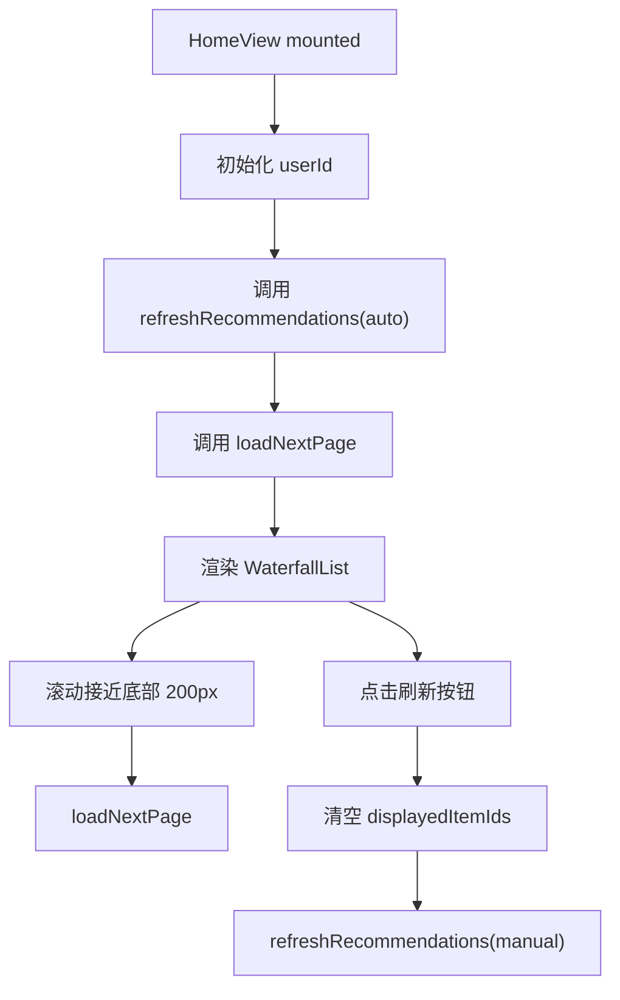
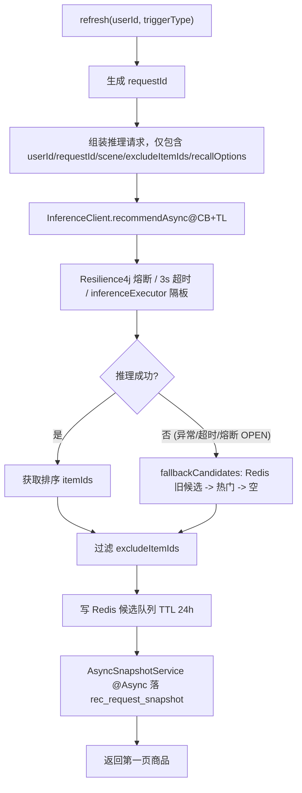
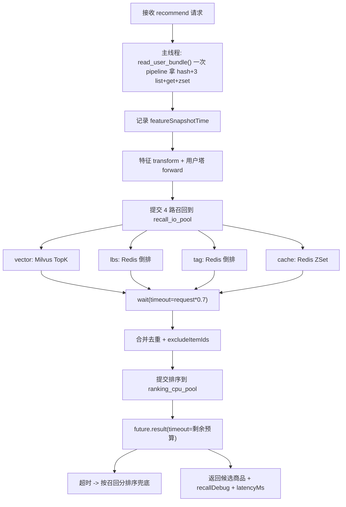
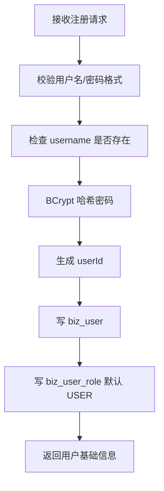
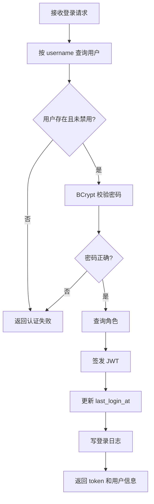

# 详细设计文档

## 1. 前端详细设计

### 1.1 页面结构

```text
src
├── api
│   ├── recommendation.js
│   ├── item.js
│   └── tracking.js
├── components
│   ├── ProductCard.vue
│   ├── WaterfallList.vue
│   └── RefreshBar.vue
├── stores
│   ├── user.js
│   ├── recommendation.js
│   └── cart.js
├── composables
│   ├── useExposureTracker.js
│   ├── useInfiniteScroll.js
│   └── useBehaviorTracker.js
└── views
    └── HomeView.vue
```

### 1.2 HomeView 逻辑

职责：

- 初始化用户 ID。
- 首次进入时触发推荐刷新。
- 加载第一页推荐商品。
- 监听滚动并预取下一页。
- 处理手动刷新。

流程：



### 1.3 recommendation Store

状态：

| 字段 | 说明 |
| --- | --- |
| items | 当前已展示商品 |
| displayedItemIds | 前端去重集合 |
| requestId | 当前推荐批次 ID |
| cursor | 分页游标 |
| hasMore | 是否还有更多 |
| loading | 是否加载中 |
| refreshing | 是否刷新中 |

核心方法：

| 方法 | 说明 |
| --- | --- |
| refresh(triggerType) | 调用刷新接口，重置列表和游标 |
| loadNextPage() | 加载下一页并过滤重复 itemId |
| markDisplayed(itemId) | 记录前端已展示商品 |
| reset() | 清空推荐状态 |

### 1.4 曝光埋点

使用 `IntersectionObserver`：

- 商品卡片进入视口比例达到 50% 时触发曝光。
- 同一 `requestId + itemId` 只发送一次曝光。
- 曝光行为发送到 Nginx `/track/behavior`。
- 同时调用后端 `/recommendations/exposure` 更新曝光集合。

### 1.5 行为埋点

| 用户操作 | behaviorType | 额外动作 |
| --- | --- | --- |
| 点击商品卡片 | 1 | 不跳转详情页 |
| 点击收藏按钮 | 2 | 切换收藏 UI 状态 |
| 点击加购物车 | 3 | 写入 cart Store |
| 点击购买 | 4 | 调用模拟购买接口 |

## 2. 后端详细设计

### 2.1 包结构

```text
com.example.recsys
├── RecsysApplication.java
├── common
│   ├── config
│   ├── exception
│   ├── response
│   └── util
├── controller
├── application
├── domain
├── infrastructure
│   ├── mysql
│   ├── redis
│   ├── kafka
│   └── client
└── scheduler
```

### 2.2 主要类设计

| 类 | 职责 |
| --- | --- |
| `RecommendationController` | 首页推荐、刷新、曝光确认接口 |
| `ItemController` | 商品批量查询接口 |
| `MockOrderController` | 模拟购买接口 |
| `RecommendationAppService` | 推荐请求编排 |
| `CandidateDomainService` | 候选队列、曝光判断、缓存召回 |
| `InferenceClient` | 调用 Python 推理服务 |
| `ItemRepository` | 商品查询 |
| `RedisCandidateRepository` | Redis 候选读写 |
| `BehaviorKafkaConsumer` | 消费行为日志 |
| `BehaviorBatchFlushScheduler` | 每天凌晨批量写 MySQL |
| `AsyncSnapshotService` | `@Async("snapshotExecutor")`：把 `rec_request_snapshot` 落库剥离推荐主链路 |
| `LoginAttemptService` | Redis 计数：IP 限流 + 账号失败锁定 |
| `ExecutorsConfig` | 定义 `inferenceExecutor` / `snapshotExecutor` / `kafkaFlushExecutor` 三个独立有界池 |
| `HttpClientConfig` | Apache HttpClient5 连接池 + `inferenceRestTemplate` + `TraceHeaderInterceptor` |
| `RefreshTokenRepository` | refresh token 一次性 + 用户级 Set，支持 forceLogoutAll 全部 revoke |
| `TraceHeaderInterceptor` | 把当前 trace 上下文以 W3C `traceparent` 写到推理 RPC |

### 2.2.x InferenceClient AOP 约束（强制）

**`InferenceClient.recommendAsync(...)` 必须由外部 Bean（如 `RecommendationService`）直接调用，**
**才能让 `@CircuitBreaker` / `@TimeLimiter` 生效。**

❌ 错误做法：在 `InferenceClient` 内部写一个 `recommend()` sync wrapper 调用 `this.recommendAsync()`。
Spring AOP 通过代理生效，**self-invocation 会绕过代理，所有保护栈失效**。

✅ 正确做法：
```java
// in RecommendationService
InferenceClient.Result inf = inferenceClient
        .recommendAsync(requestId, userId, scene, exclude, recallSize)
        .join();
```

如果一定要 sync 入口，把它放在另一个 Bean 里（例如 `InferenceFacade`），让 Spring 注入 `InferenceClient` 代理。

### 2.3 推荐刷新逻辑



> 推理调用细节、线程池容量、熔断阈值见 `10_高并发设计.md`。

### 2.4 曝光处理逻辑

1. 接收 `userId`、`requestId`、`itemIds`。
2. 将 itemIds 写入 `rec:exposed:{userId}:{requestId}`。
3. 从 `rec:cache:{userId}` 删除已曝光商品。
4. 比较曝光数量和候选数量。
5. 如果全部曝光，返回 `allExposed=true`。

### 2.5 Kafka Consumer

设计：

- Kafka 实时消费消息后先进入内存缓冲区。
- 按数量或时间批量写入 MySQL。
- 每天凌晨执行一次强制 flush。
- 写入失败时记录错误日志，保留失败批次到本地临时文件。

## 3. 数据链路详细设计

### 3.1 Flink 实时特征

输入：Kafka `user_behavior_log`。

输出：Redis 用户实时特征。

维护状态：

| 状态 | 说明 |
| --- | --- |
| clickSeq | 最近点击商品序列 |
| cartSeq | 最近加购商品序列 |
| purchaseSeq | 最近购买商品序列 |
| behaviorCnt1h | 最近 1 小时行为计数 |
| categoryPreference | 类目偏好计数 |

Time Split：

- Flink 只用当前事件时间及之前的事件更新状态。
- 在线推理只读取当前时刻之前已经进入 Redis 的状态。

### 3.2 Spark 离线特征

输入：

- `biz_user`
- `biz_item`
- `rec_behavior_log`
- `tianchi_mobile_recommend_train_user`
- `tianchi_mobile_recommend_train_item`

输出：

- 召回训练样本。
- 排序训练样本。
- 特征配置 `feature_config.json`。
- 热门商品表 `rec_item_popularity`。

样本构造：

- 召回正样本：点击、收藏、加购、购买。
- 召回负样本：全局热门池随机负采样 + Batch 内负采样。
- 排序 CTR 正样本：点击 (1)、购买 (4)。
- 排序 CTR 负样本：**离线场景**——天池数据集不含曝光记录，使用"用户未交互过的热门商品"作为伪曝光负样本；**在线场景**——Nginx 埋点写入 `behavior_type=0` 后可使用"同窗口曝光未点击"。
- 排序 CVR 正样本：购买 (4)。
- 排序 CVR 负样本：点击 (1) 且同一 (user_id, item_id) 上没有后续购买。
- 训练数据规模上限：**1000 万行行为**（由 `--max-rows` 控制，含 import 和 Spark 抽样两道关卡）。

## 4. 算法详细设计

### 4.1 统一特征预处理

目录：

```text
algorithm/common/features
├── schema.py
├── id_mapping.py
├── normalizer.py
├── bucketizer.py
└── transform.py
```

要求：

- 离线训练和在线推理只能调用同一套 transform。
- 所有连续特征的均值、方差、分桶边界写入 `feature_config.json`。
- 未知用户 ID 映射到 `<UNK>`。
- 训练时随机将部分 userId 替换为 `<UNK>`，增强未知用户泛化。

### 4.2 双塔召回

用户塔输入：

- user_id embedding。
- 用户离散特征 embedding。
- 用户连续特征。
- 用户实时点击序列聚合特征（**与 item tower 共享同一张 `item_id` embedding**，避免"用户点过 X"和"商品 X"对模型而言是不同实体）。

物品塔输入：

- item_id embedding（**与 user tower 共享**）。
- item_category embedding。
- 商品位置特征。
- 商品连续统计特征。

vocab 默认值（见 `algorithm/common/features/schema.py DEFAULT_CAT_VOCAB_SIZE`）：

| cat 列 | vocab |
| --- | --- |
| user_id | 1,000,000 |
| item_id | 2,000,000 |
| item_category | 100,000 |
| brand | 100,000 |
| price_bucket | 1,000 |
| gender | 8 |
| age_level | 32 |

训练：

- 使用 Pairwise loss。
- 正样本为高价值行为。
- 负样本使用随机负采样和 Batch 内负采样。
- 每天凌晨使用前 7 天数据训练。

发布：

- 保存用户塔 `.pt`。
- 保存用户 ID embedding 哈希表。
- 物品塔全量 forward，写入 Milvus。
- 更新 `rec_model_version`。

### 4.3 MMoE 排序

目标：

- 预测 CTR。
- 预测购买率。

结构：

- 4 个专家网络。
- 每个专家使用 DCN + 一层隐藏层，输出维度 128。
- 每个任务一个 gate。
- 每个任务塔 3 层隐藏层。
- 训练时在专家加权和之前随机关闭一个专家，缓解专家极化。

排序分：

```text
rankScore = 0.7 * CTR + 0.3 * CVR
```

MVP 可以先使用固定权重，后续根据业务目标调整。

## 5. 在线推理详细设计

### 5.1 推理服务启动

启动时完成：

1. 读取 `conf/application-local.yml`。
2. 加载特征配置。
3. 加载用户塔模型。
4. 加载排序模型。
5. 加载用户 ID embedding 哈希表。
6. 初始化 Milvus 连接。
7. **创建 `recall_io_pool`（默认 32）和 `ranking_cpu_pool`（默认 = 物理核数），见 `algorithm/inference/executors.py`。**
8. 预热一次空请求。

### 5.2 推理请求处理（并发版）



并发与超时约束（见 `10_高并发设计.md` §4）：

- 单请求总超时 `RECSYS_REQUEST_TIMEOUT_SEC`（默认 2.5s），略小于后端 `TimeLimiter` 3s。
- 4 路召回任一超时不影响整体，仅在 `recallDebug` 中显示该路 size=0。
- 排序与召回 I/O 物理隔离：Milvus 卡住不会拖死 PyTorch forward。

### 5.3 推理降级

- 用户 ID 不存在：使用 `<UNK>` embedding。
- 特征缺失：使用训练期默认值。
- Milvus 查询失败：返回热门商品候选。
- 排序模型失败：按召回分排序。

### 5.4 特征读取职责

在线推理阶段，推荐特征的 source of truth 是 Redis，读取方统一为 Python 推理服务。

- Spring Boot 不读取用户实时特征作为推理输入。
- Spring Boot 不读取 LBS 倒排和标签倒排作为推理输入。
- Python 推理服务根据 `userId` 读取 `feature:user:*`、`feature:user:tag_pref:*`、`feature:user:last_geo:*`。
- Python 推理服务根据用户 geohash 和标签偏好读取 `rec:lbs:index:*`、`rec:tag:index:*`。
- 同一次请求返回 `featureSnapshotTime`，用于排查特征快照时间。

## 6. LBS 召回详细设计

### 6.1 输入

| 输入 | 来源 |
| --- | --- |
| 用户最近 geohash | Redis `feature:user:last_geo:{userId}` |
| 商品 geohash | MySQL `biz_item.item_geohash` 或 Redis LBS 倒排 |
| geohash 前缀长度 | 配置 `recommendation.lbsGeoHashPrefixLength` |
| 最大距离 | 配置 `recommendation.lbsMaxDistanceKm` |

### 6.2 召回逻辑

1. 从 Redis 读取用户最近 geohash。
2. 如果为空，跳过 LBS 召回。
3. 截取 geohash 前缀，例如长度为 5。
4. 查询 `rec:lbs:index:{geohashPrefix}`。
5. 按 score 取 TopN。
6. 若后续实现精确经纬度，可再按距离过滤。
7. 输出带 `recallChannel=lbs` 的候选商品。

### 6.3 特征更新时间

- Flink 只用当前行为事件中的 `user_geohash` 更新用户位置。
- 在线推理读取的是推荐请求之前已经写入 Redis 的位置。
- 离线训练构造 LBS 特征时必须保证 `geo_feature_time < label_time`。

## 7. 标签召回详细设计

### 7.1 标签维度

| 维度 | 来源 | 示例 |
| --- | --- | --- |
| item_category | 天池商品类目 | `300` |
| brand | 商品业务扩展字段 | `nike` |
| style | 商品风格标签 | `street` |
| price_bucket | 价格分桶 | `100_300` |
| geo_bucket | 地理区域标签 | `wx4g0` |

### 7.2 用户标签偏好更新

Flink 根据行为类型给标签加权：

| 行为 | behaviorType | 标签加权 |
| --- | --- | --- |
| 曝光 | 0 | 可选，默认不加分 |
| 点击 | 1 | +1 |
| 收藏 | 2 | +2 |
| 加购 | 3 | +3 |
| 购买 | 4 | +5 |

更新目标：

- Redis `feature:user:tag_pref:{userId}`。
- 离线任务每日更新 MySQL `rec_user_tag_preference`。

### 7.3 召回逻辑

1. 读取用户 TopN 标签偏好。
2. 根据配置筛选允许的标签维度。
3. 对每个标签读取 `rec:tag:index:{tagType}:{tagValue}`。
4. 不同标签召回结果按标签偏好分和商品标签权重加权。
5. 合并去重后输出 `recallChannel=tag`。

标签召回基础分：

```text
tagRecallScore = userTagPreferenceScore * itemTagWeight
```

### 7.4 多路合并

同一商品可能来自多个召回通道。合并时保留所有通道来源，并计算融合召回分：

```text
mergedRecallScore =
  0.50 * vectorScore +
  0.20 * tagScore +
  0.15 * lbsScore +
  0.15 * cacheScore
```

缺失的通道分按 0 处理。最终排序仍由 MMoE 输出的 `rankScore` 决定，召回分只作为排序特征之一。

## 8. 用户管理详细设计

### 8.1 前端模块

新增目录建议：

```text
src
├── api
│   └── auth.js
├── stores
│   └── user.js
└── views
    ├── LoginView.vue
    ├── RegisterView.vue
    └── AdminUserView.vue
```

`user Store` 状态：

| 字段 | 说明 |
| --- | --- |
| userId | 当前用户 ID，未登录时为游客 ID |
| token | JWT access token |
| roles | 当前用户角色 |
| profile | 用户资料 |
| isLogin | 是否登录 |

前端请求拦截：

- Axios 请求拦截器读取 token。
- 如果 token 存在，添加 `Authorization: Bearer <token>`。
- 登录成功后切换推荐 Store 的 `userId`。

### 8.2 后端包结构

```text
com.example.recsys
├── security
│   ├── JwtTokenProvider.java
│   ├── JwtAuthenticationFilter.java
│   └── SecurityConfig.java
├── controller
│   ├── AuthController.java
│   ├── UserController.java
│   └── AdminUserController.java
├── application
│   ├── AuthService.java
│   └── UserService.java
└── infrastructure
    ├── mysql
    │   ├── UserMapper.java
    │   ├── RoleMapper.java
    │   └── UserRoleMapper.java
    └── redis
        └── AuthRedisRepository.java
```

### 8.3 注册逻辑



### 8.4 登录逻辑



### 8.5 权限校验

- 普通用户接口：需要有效 token。
- 推荐首页浏览：允许游客访问。
- 管理员接口：需要 `ADMIN` 角色。
- 被禁用用户：不能登录；如果启用黑名单，禁用时使已有 token 失效。

### 8.6 与推荐系统的关系

- `biz_user.user_id` 是推荐链路的统一用户标识。
- 行为埋点中的 `userId` 应使用登录用户 `userId`。
- 用户默认 geohash 可作为 LBS 召回的兜底位置。
- 用户年龄段、性别等字段可作为后续排序模型的用户离散特征。
