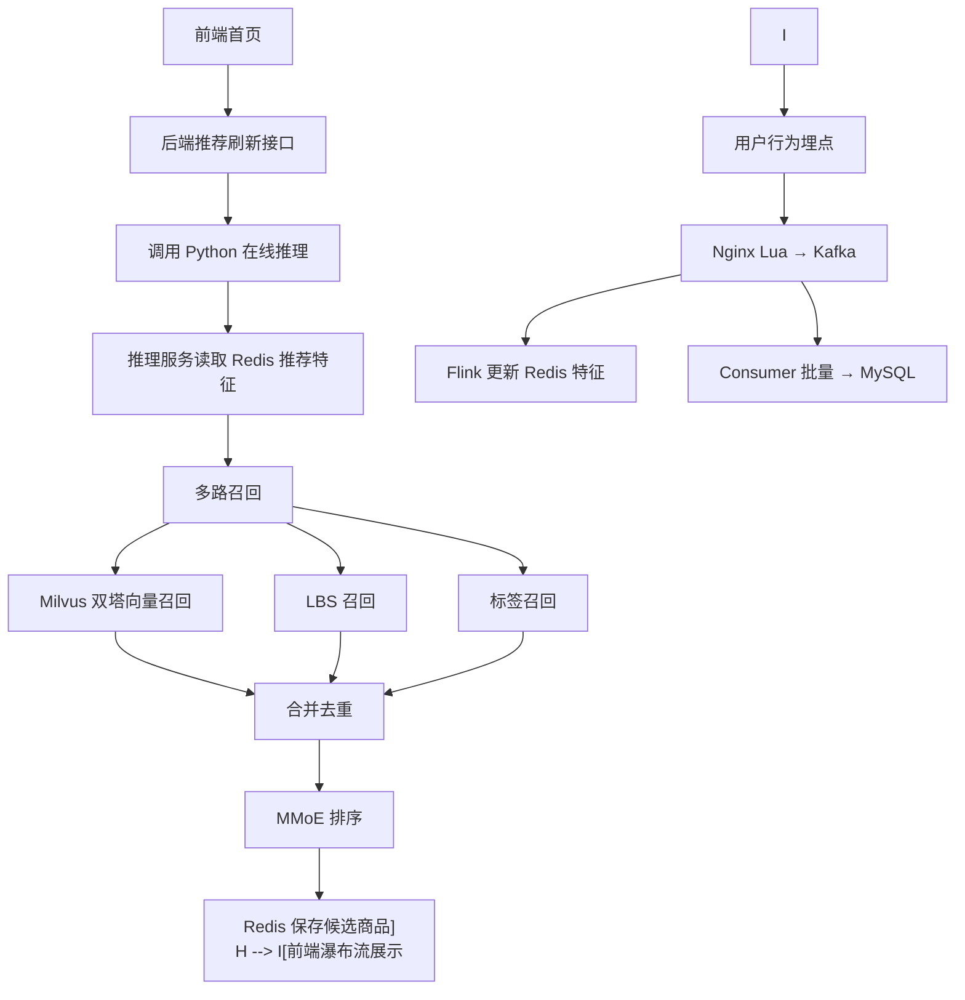

# 单机版电商推荐系统 README

## 1. 项目说明

本项目用于搭建一个 Windows 单机部署的电商网站与推荐系统。系统包含前端、后端、数据链路、离线模型训练和在线模型推理五个模块。
当前阶段的重点是实现模型推理链路和电商首页闭环，推荐算法效果暂不作为主要目标。
## 2. 模块说明

| 模块 | 目录 | 技术 |
| --- | --- | --- |
| 前端 | `frontend` | Vue 3、Element Plus、Pinia、Axios |
| 后端 | `backend` | Java、Spring Boot 3、Maven、MyBatis-Plus |
| 数据链路 | `data-pipeline` | Kafka、Flink、Spark |
| 离线训练 | `algorithm/training` | Python、PyTorch、Spark |
| 在线推理 | `algorithm/inference` | Python、PyTorch、Milvus、TorchServe/FastAPI |
| 配置 | `conf` | YAML |
| 文档 | `docs` | Markdown |

## 3. 目录结构

```text
E:\End-To-End_Recommendation_System_X
├── conf
│   └── application-local.yml
├── docs
├── frontend
├── backend
├── data-pipeline
├── algorithm
├── scripts
├── logs
├── data
│   ├── raw
│   ├── processed
│   └── model
└── deploy
```

## 4. 本地依赖

建议版本：

| 依赖 | 版本 |
| --- | --- |
| Windows | 10/11 |
| Node.js | 20 LTS |
| Java | 17 |
| Maven | 3.9+ |
| Python | 3.10+ |
| MySQL | 8.x |
| Redis | 7.x |
| Kafka | 3.x |
| Flink | 1.18+ |
| Spark | 3.5+ |
| Milvus | 2.4+ |
| PyTorch | 2.x |

单机 Windows 环境中，Kafka、Flink、Spark、Milvus 可优先使用 Docker Desktop 或本地发行包。MVP 阶段可以先跳过 Flink/Spark，直接跑后端、MySQL、Redis、推理服务和前端。
## 5. 配置文件

所有配置集中在：
```text
E:\End-To-End_Recommendation_System_X\conf\application-local.yml
```

示例：
```yaml
server:
  backendPort: 8080
  inferencePort: 9000
  frontendPort: 5173

mysql:
  host: localhost
  port: 3306
  database: end_to_end_recommendation_system_x
  username: root
  password: change_me

redis:
  host: localhost
  port: 6379
  password: ""
  database: 0

kafka:
  bootstrapServers: localhost:9092
  behaviorTopic: user_behavior_log

milvus:
  host: localhost
  port: 19530
  collection: item_embedding
```

## 6. 推荐核心流程



## 7. MVP 启动顺序

实现代码后建议按以下顺序启动：
1. MySQL → 2. Redis → 3. Milvus → 4. Kafka → 5. Python 在线推理服务 → 6. Spring Boot 后端服务 → 7. Vue 前端服务 → 8. Nginx Lua 行为采集服务。?9. Flink 实时特征任务。
MVP 联调可先启动：
1. MySQL → 2. Redis → 3. Python 在线推理服务 → 4. Spring Boot 后端服务 → 5. Vue 前端服务。?
## 8. 数据准备

数据集：**阿里巴巴移动推荐算法数据集**（天池）

| 项 | 内容 |
| --- | --- |
| 下载地址 | https://tianchi.aliyun.com/dataset/46 |
| user.csv | ~23M 条 / ~1 GB |
| item.csv | ~620K 条 / ~10 MB |
| 时间范围 | 2014-11-18 至 2014-12-18 |

原始数据放置位置：
```text
E:\End-To-End_Recommendation_System_X\data\raw\tianchi_mobile_recommend_train_user.csv
E:\End-To-End_Recommendation_System_X\data\raw\tianchi_mobile_recommend_train_item.csv
```

字段映射、行为类型、负样本构造细节统一见 `09_天池数据映射.md`。
**训练数据规模约定：本期最多使。1000 万行用户行为**（`import_raw_data.py --max-rows` 与 `offline_samples_job.py --max-rows` 双向上限）。
导入命令：
```powershell
# 1) 先抽样到本地可用规模（可选，推荐先跑 5000 用户：

```bash
python scripts/sample_tianchi.py --users 5000

# 2) 导入；user.csv 默认上限 1000 万行
python scripts/import_raw_data.py --max-rows 10000000
```

导入后应生成

- 原始表 `tianchi_mobile_recommend_train_user / _item`。
- 商品基础表 `biz_item`（占位字段：title="商品 {item_id}", brand="unknown" 等）。
- 行为明细表 `rec_behavior_log`（source='import'，behavior_type 为 1/2/3/4）。

- 商品标签表 `rec_item_tag`（基于 item_category / brand / price_bucket 派生）。

- 热门商品表 `rec_item_popularity` 由后端 Spark `popularity_job.py` 生成。
## 9. 模型文件

模型文件放置位置：
```text
E:\End-To-End_Recommendation_System_X\data\model
```

建议文件：

| 文件 | 说明 |
| --- | --- |
| `recall_user_tower.pt` | 召回用户塔 |
| `ranking_mmoe.pt` | MMoE 排序模型 |
| `feature_config.json` | 特征预处理配 |
| `user_embedding_table.pt` | 用户 ID embedding 哈希表 |
| `model_version.json` | 当前发布模型版本 |

## 10. 文档清单

| 文档 | 说明 |
| --- | --- |
| `01_PRD.md` | 产品需求 |
| `02_产品路线图.md` | 阶段计划 |
| `03_技术方案设计.md` | 技术选型、架构和模块划分 |
| `04_数据库设计.md` | MySQL、Redis、Kafka、Milvus 设计 |
| `05_API接口设计.md` | REST API、推荐 API、行为采集 API |
| `06_详细设计.md` | 前端、后端、数据链路、算法详细逻辑 |
| `07_开发规范.md` | 代码、配置、日志、测试规范 |
| `08_README.md` | 项目说明和启动规范 |
| `09_天池数据映射.md` | 天池数据集字段、行为映射、训练规模约定 |
| `10_高并发设计.md` | 线程池隔离、熔断超时、登录限流、容量推算与故障注入指南 |
| `11_变更记录.md` | 结构性修改的逐条变更记录 |


## 11. 当前状态
| 模块 | 状态 |
| --- | --- |
| 后端 Spring Boot 3.2 + JWT(access+refresh) + Resilience4j + HttpClient5 | 是 |
| Flyway 迁移（V1/V2/V3 | 是 |
| 推理 FastAPI + 双塔召回 + MMoE 排序 + 召回/排序线程池隔 | 是 |
| 前端 Vue 3 + Element Plus + Pinia + 瀑布流 + 埋点 + axios 自动 refresh | 是 |
| 数据链路 Nginx Lua + Kafka + PyFlink + Spark | 是 |
| 训练 PyTorch + Milvus 发布 + 天池数据导入 / 1000 万行上限 | 是 |
| 高并发与熔断设计见 `10_高并发设计.md` | 是 |
| 分布式 trace（Micrometer Tracing + W3C traceparent 到 Python | 是 |
| 监控（Java actuator/prometheus + Python /metrics` | 是 |
| 单元 + 切片测试（JUnit + pytest | 是 |
| CORS 配置化白名单 | 是 |

## 12. 用户体系说明

后端需要提供基础用户体系

- 用户注册：`POST /api/v1/auth/register`
- 用户登录：`POST /api/v1/auth/login`
- 当前用户：`GET /api/v1/users/me`
- 修改资料：`PUT /api/v1/users/me`
- 修改密码：`PUT /api/v1/users/me/password`
- 管理员用户列表：`GET /api/v1/admin/users`
- 管理员禁用/启用：`PUT /api/v1/admin/users/{userId}/status`

认证方式

- 登录成功后返回 JWT
- 前端 Axios 自动携带 `Authorization: Bearer <token>`。
- 管理员接口要。`ADMIN` 角色

- 推荐接口对登录用户优先使。token 中的 `userId`，游客用户继续使用临时 `userId`。