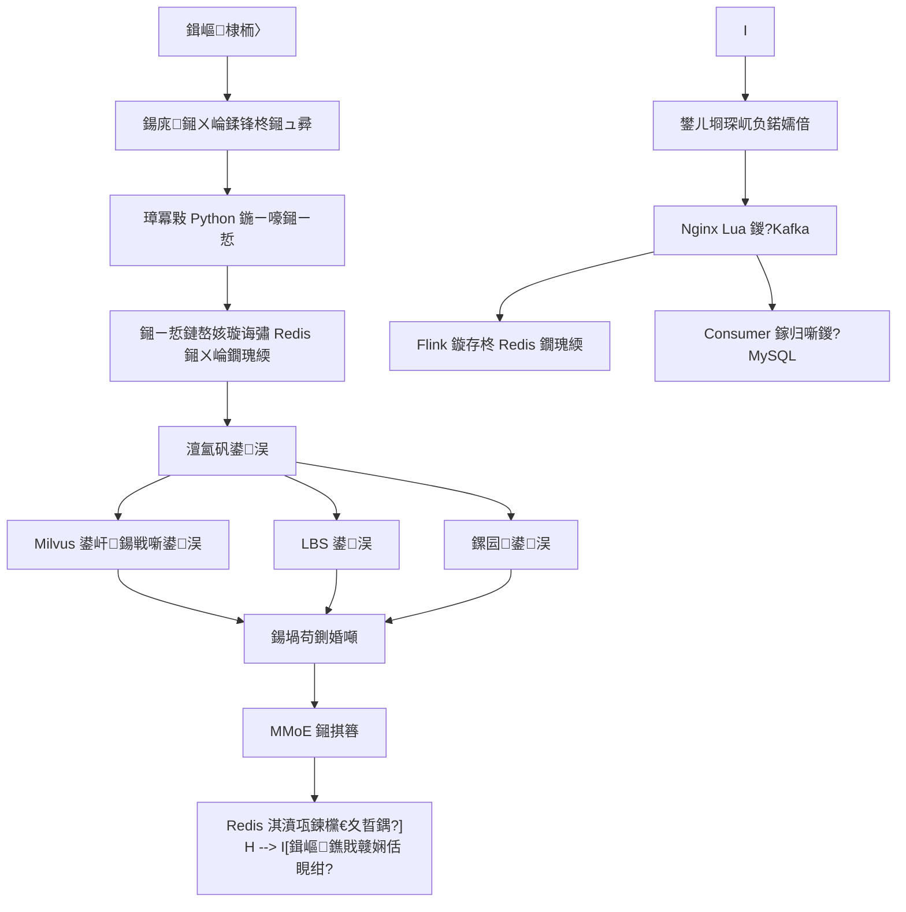

# 鍗曟満鐗堢數鍟嗘帹鑽愮郴缁?README

## 1. 椤圭洰璇存槑

鏈」鐩敤浜庢惌寤轰竴涓?Windows 鍗曟満閮ㄧ讲鐨勭數鍟嗙綉绔欎笌鎺ㄨ崘绯荤粺銆傜郴缁熷寘鍚墠绔€佸悗绔€佹暟鎹摼璺€佺绾挎ā鍨嬭缁冨拰鍦ㄧ嚎妯″瀷鎺ㄧ悊浜斾釜妯″潡銆?
褰撳墠闃舵鐨勯噸鐐规槸瀹炵幇妯″瀷鎺ㄧ悊閾捐矾鍜岀數鍟嗛椤甸棴鐜紝鎺ㄨ崘绠楁硶鏁堟灉鏆備笉浣滀负涓昏鐩爣銆?
## 2. 妯″潡璇存槑

| 妯″潡 | 鐩綍 | 鎶€鏈?|
| --- | --- | --- |
| 鍓嶇 | `frontend` | Vue 3銆丒lement Plus銆丳inia銆丄xios |
| 鍚庣 | `backend` | Java銆丼pring Boot 3銆丮aven銆丮yBatis-Plus |
| 鏁版嵁閾捐矾 | `data-pipeline` | Kafka銆丗link銆丼park |
| 绂荤嚎璁粌 | `algorithm/training` | Python銆丳yTorch銆丼park |
| 鍦ㄧ嚎鎺ㄧ悊 | `algorithm/inference` | Python銆丳yTorch銆丮ilvus銆乀orchServe/FastAPI |
| 閰嶇疆 | `conf` | YAML |
| 鏂囨。 | `docs` | Markdown |

## 3. 鐩綍缁撴瀯

```text
E:\End-To-End_Recommendation_System_X
鈹溾攢鈹€ conf
鈹?  鈹斺攢鈹€ application-local.yml
鈹溾攢鈹€ docs
鈹溾攢鈹€ frontend
鈹溾攢鈹€ backend
鈹溾攢鈹€ data-pipeline
鈹溾攢鈹€ algorithm
鈹溾攢鈹€ scripts
鈹溾攢鈹€ logs
鈹溾攢鈹€ data
鈹?  鈹溾攢鈹€ raw
鈹?  鈹溾攢鈹€ processed
鈹?  鈹斺攢鈹€ model
鈹斺攢鈹€ deploy
```

## 4. 鏈湴渚濊禆

寤鸿鐗堟湰锛?
| 渚濊禆 | 鐗堟湰 |
| --- | --- |
| Windows | 10/11 |
| Node.js | 20 LTS |
| Java | 17 |
| Maven | 3.9+ |
| Python | 3.10+ |
| MySQL | 8.x |
| Redis | 7.x |
| Kafka | 3.x |
| Flink | 1.18+ |
| Spark | 3.5+ |
| Milvus | 2.4+ |
| PyTorch | 2.x |

鍗曟満 Windows 鐜涓紝Kafka銆丗link銆丼park銆丮ilvus 鍙紭鍏堜娇鐢?Docker Desktop 鎴栨湰鍦板彂琛屽寘銆侻VP 闃舵鍙互鍏堣烦杩?Flink/Spark锛岀洿鎺ヨ窇鍚庣銆丮ySQL銆丷edis銆佹帹鐞嗘湇鍔″拰鍓嶇銆?
## 5. 閰嶇疆鏂囦欢

鎵€鏈夐厤缃泦涓湪锛?
```text
E:\End-To-End_Recommendation_System_X\conf\application-local.yml
```

绀轰緥锛?
```yaml
server:
  backendPort: 8080
  inferencePort: 9000
  frontendPort: 5173

mysql:
  host: localhost
  port: 3306
  database: end_to_end_recommendation_system_x
  username: root
  password: change_me

redis:
  host: localhost
  port: 6379
  password: ""
  database: 0

kafka:
  bootstrapServers: localhost:9092
  behaviorTopic: user_behavior_log

milvus:
  host: localhost
  port: 19530
  collection: item_embedding
```

## 6. 鎺ㄨ崘鏍稿績娴佺▼



## 7. MVP 鍚姩椤哄簭

瀹炵幇浠ｇ爜鍚庡缓璁寜浠ヤ笅椤哄簭鍚姩锛?
1. MySQL銆?2. Redis銆?3. Milvus銆?4. Kafka銆?5. Python 鍦ㄧ嚎鎺ㄧ悊鏈嶅姟銆?6. Spring Boot 鍚庣鏈嶅姟銆?7. Vue 鍓嶇鏈嶅姟銆?8. Nginx Lua 琛屼负閲囬泦鏈嶅姟銆?9. Flink 瀹炴椂鐗瑰緛浠诲姟銆?
MVP 鑱旇皟鍙厛鍚姩锛?
1. MySQL銆?2. Redis銆?3. Python 鍦ㄧ嚎鎺ㄧ悊鏈嶅姟銆?4. Spring Boot 鍚庣鏈嶅姟銆?5. Vue 鍓嶇鏈嶅姟銆?
## 8. 鏁版嵁鍑嗗

鏁版嵁闆嗭細**闃块噷宸村反绉诲姩鎺ㄨ崘绠楁硶鏁版嵁闆?*锛堝ぉ姹狅級

| 椤?| 鍐呭 |
| --- | --- |
| 涓嬭浇椤?| https://tianchi.aliyun.com/dataset/46 |
| user.csv | ~23M 琛?/ ~1 GB |
| item.csv | ~620K 琛?/ ~10 MB |
| 鏃堕棿鑼冨洿 | 2014-11-18 鈫?2014-12-18 |

鍘熷鏁版嵁鏀剧疆浣嶇疆锛?
```text
E:\End-To-End_Recommendation_System_X\data\raw\tianchi_mobile_recommend_train_user.csv
E:\End-To-End_Recommendation_System_X\data\raw\tianchi_mobile_recommend_train_item.csv
```

瀛楁鏄犲皠銆佽涓虹被鍨嬨€佽礋鏍锋湰鏋勯€犵粏鑺傜粺涓€瑙?`09_澶╂睜鏁版嵁鏄犲皠.md`銆?
**璁粌鏁版嵁瑙勬ā绾﹀畾锛氭湰鏈熸渶澶氫娇鐢?1000 涓囪鐢ㄦ埛琛屼负**锛坄import_raw_data.py --max-rows`銆?`offline_samples_job.py --max-rows` 鍙屽悜涓婇檺锛夈€?
瀵煎叆鍛戒护锛?
```powershell
# 1) 鍏堟娊鏍峰埌鏈湴鍙敤瑙勬ā锛堝彲閫夛紝鎺ㄨ崘鍏堣窇 5000 鐢ㄦ埛锛?python scripts/sample_tianchi.py --users 5000

# 2) 瀵煎叆锛泆ser.csv 榛樿涓婇檺 1000 涓囪
python scripts/import_raw_data.py --max-rows 10000000
```

瀵煎叆鍚庡簲鐢熸垚锛?
- 鍘熷琛?`tianchi_mobile_recommend_train_user / _item`銆?- 鍟嗗搧鍩虹琛?`biz_item`锛堝崰浣嶅瓧娈碉細title="鍟嗗搧 {item_id}", brand="unknown" 绛夛級銆?- 琛屼负鏄庣粏琛?`rec_behavior_log`锛坰ource='import'锛宐ehavior_type 浠?1/2/3/4锛夈€?- 鍟嗗搧鏍囩琛?`rec_item_tag`锛堝熀浜?item_category / brand / price_bucket 娲剧敓锛夈€?- 鐑棬鍟嗗搧琛?`rec_item_popularity` 鐢卞悗缁?Spark `popularity_job.py` 鐢熸垚銆?
## 9. 妯″瀷鏂囦欢

妯″瀷鏂囦欢鏀剧疆浣嶇疆锛?
```text
E:\End-To-End_Recommendation_System_X\data\model
```

寤鸿鏂囦欢锛?
| 鏂囦欢 | 璇存槑 |
| --- | --- |
| `recall_user_tower.pt` | 鍙洖鐢ㄦ埛濉?|
| `ranking_mmoe.pt` | MMoE 鎺掑簭妯″瀷 |
| `feature_config.json` | 鐗瑰緛棰勫鐞嗛厤缃?|
| `user_embedding_table.pt` | 鐢ㄦ埛 ID embedding 鍝堝笇琛?|
| `model_version.json` | 褰撳墠鍙戝竷妯″瀷鐗堟湰 |

## 10. 鏂囨。娓呭崟

| 鏂囨。 | 璇存槑 |
| --- | --- |
| `01_PRD.md` | 浜у搧闇€姹?|
| `02_浜у搧璺嚎鍥?md` | 闃舵璁″垝 |
| `03_鎶€鏈柟妗堣璁?md` | 鎶€鏈€夊瀷銆佹灦鏋勫拰妯″潡鍒掑垎 |
| `04_鏁版嵁搴撹璁?md` | MySQL銆丷edis銆並afka銆丮ilvus 璁捐 |
| `05_API鎺ュ彛璁捐.md` | REST API銆佹帹鐞?API銆佽涓洪噰闆?API |
| `06_璇︾粏璁捐.md` | 鍓嶇銆佸悗绔€佹暟鎹摼璺€佺畻娉曡缁嗛€昏緫 |
| `07_寮€鍙戣鑼?md` | 浠ｇ爜銆侀厤缃€佹棩蹇椼€佹祴璇曡鑼?|
| `08_README.md` | 椤圭洰璇存槑鍜屽惎鍔ㄨ鍒?|
| `09_澶╂睜鏁版嵁鏄犲皠.md` | 澶╂睜鏁版嵁闆嗗瓧娈点€佽涓烘槧灏勩€佽缁冭妯＄害瀹?|
| `10_楂樺苟鍙戣璁?md` | 绾跨▼姹犻殧绂汇€佺啍鏂秴鏃躲€佺櫥褰曢檺娴併€佸閲忔帹绠椾笌鏁呴殰娉ㄥ叆鎸囧崡 |
| `11_鍙樻洿璁板綍.md` | 缁撴瀯鎬т慨鏀圭殑閫愭潯鍙樻洿璁板綍 |


## 11. 褰撳墠鐘舵€?
| 妯″潡 | 鐘舵€?|
| --- | --- |
| 鍚庣 Spring Boot 3.2 + JWT(access+refresh) + Resilience4j + HttpClient5 | 鉁?|
| Flyway 杩佺Щ锛圴1/V2/V3锛?| 鉁?|
| 鎺ㄧ悊 FastAPI + 鍙屽鍙洖 + MMoE 鎺掑簭 + 鍙洖/鎺掑簭绾跨▼姹犻殧绂?| 鉁?|
| 鍓嶇 Vue 3 + Element Plus + Pinia + 鐎戝竷娴?+ 鍩嬬偣 + axios 鑷姩 refresh | 鉁?|
| 鏁版嵁閾捐矾 Nginx Lua + Kafka + PyFlink + Spark | 鉁?|
| 璁粌 PyTorch + Milvus 鍙戝竷 + 澶╂睜鏁版嵁瀵煎叆 / 1000 涓囪涓婇檺 | 鉁?|
| 楂樺苟鍙戜笌鐔旀柇璁捐锛?0_楂樺苟鍙戣璁?md锛?| 鉁?|
| 鍒嗗竷寮?trace锛圡icrometer Tracing + W3C traceparent 鈫?Python锛?| 鉁?|
| 鐩戞帶锛圝ava actuator/prometheus + Python /metrics锛?| 鉁?|
| 鍗曞厓 + 鍒囩墖娴嬭瘯锛圝Unit + pytest锛?| 鉁?|
| CORS 閰嶇疆鍖栫櫧鍚嶅崟 | 鉁?|

## 12. 鐢ㄦ埛浣撶郴璇存槑

鍚庣闇€瑕佹彁渚涘熀纭€鐢ㄦ埛浣撶郴锛?
- 鐢ㄦ埛娉ㄥ唽锛歚POST /api/v1/auth/register`
- 鐢ㄦ埛鐧诲綍锛歚POST /api/v1/auth/login`
- 褰撳墠鐢ㄦ埛锛歚GET /api/v1/users/me`
- 淇敼璧勬枡锛歚PUT /api/v1/users/me`
- 淇敼瀵嗙爜锛歚PUT /api/v1/users/me/password`
- 绠＄悊鍛樼敤鎴峰垪琛細`GET /api/v1/admin/users`
- 绠＄悊鍛樼鐢?鍚敤锛歚PUT /api/v1/admin/users/{userId}/status`

璁よ瘉鏂瑰紡锛?
- 鐧诲綍鎴愬姛鍚庤繑鍥?JWT銆?- 鍓嶇 Axios 鑷姩鎼哄甫 `Authorization: Bearer <token>`銆?- 绠＄悊鍛樻帴鍙ｈ姹?`ADMIN` 瑙掕壊銆?- 鎺ㄨ崘鎺ュ彛瀵圭櫥褰曠敤鎴蜂紭鍏堜娇鐢?token 涓殑 `userId`锛屾父瀹㈢敤鎴风户缁娇鐢ㄤ复鏃?`userId`銆?